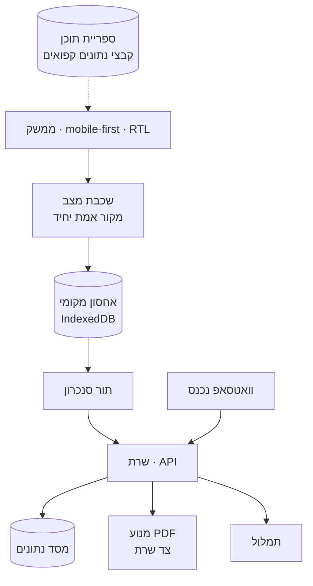

# 01 · ארכיטקטורה

## האילוץ שמכתיב הכל

המשתמש עומד במרתף באתר בנייה, עם קסדה, ביד אחת, בשמש, עם קליטה גרועה או
בלי קליטה בכלל. כל החלטה ארכיטקטונית כאן נגזרת מזה. מערכת שדורשת רשת
רציפה כדי לתפקד היא מערכת שלא עובדת במקום שבה היא אמורה לעבוד.

## שכבות

## עקרונות

**מקומי קודם, שרת אחריו.**
כל כתיבה נוחתת ב-IndexedDB מיד ומוחזרת למסך מיד. תור הסנכרון דוחף
לשרת ברקע. המשתמש לעולם לא מחכה לרשת כדי להמשיך לעבוד.
פירוט: [`10-OFFLINE-SYNC.md`](10-OFFLINE-SYNC.md).

**מקור אמת יחיד לביקור.**
אובייקט הביקור הוא האמת. כל מסך — רשימת הסעיפים, מסך הליקויים, מסך
הסיכום — הוא פונקציה טהורה מעליו. אף מסך לא מחזיק מונה משלו.
זה תיקון ישיר לבאג החמור ביותר במערכת הישנה.

**ספריית התוכן היא נתון, לא קוד.**
ספריית הבדיקה יושבת בקבצי נתונים גרסאיים תחת `data/`, נגזרת מקורפוס
החקיקה ([`13-LIBRARY-BUILD.md`](13-LIBRARY-BUILD.md)).
הקוד קורא אותם, לא מכיל אותם. עדכון רגולציה הוא שינוי נתונים עם
היסטוריה, לא deploy.

**אפס תלות חיצונית בזמן ריצה.**
כל ספרייה נארזת ב-bundle ונטענת מאותו דומיין. טעינת ספריות ליבה
מ-CDN ציבורי בזמן ריצה היא נקודת כשל יחידה, ובאתר בנייה עם קליטה
גרועה היא הכשל שיקרה.

**PDF בצד השרת.**
המסמך הזה נמסר למעביד ועשוי להגיע לחקירה או לבית משפט. הוא חייב
להיות ניתן לחיפוש, קל, ובר-חתימה דיגיטלית. הפקה בצד הלקוח מ-canvas
נותנת תמונה. פירוט: [`09-REPORT-OUTPUT.md`](09-REPORT-OUTPUT.md).

## המחסנית — אושרה

**Next.js 15 · React 19 · TypeScript · Supabase · Drizzle · Tailwind ·
Vitest · Playwright · pnpm.** פריסה ב-Vercel, RLS ב-Supabase.
אושר 21.9.2026 — ראה [`18-DECISIONS.md`](18-DECISIONS.md#d5).

בתוספת חובה, שאינה קיימת ב-studi: `axe-core` ו-`eslint-plugin-jsx-a11y`
כשערי merge ([`06-ACCESSIBILITY.md`](06-ACCESSIBILITY.md#שערי-ci)).

הדרישות שהיא נבחרה כדי לענות עליהן:

- רינדור בצד השרת או אתר סטטי — לא SPA שנטען לאט ברשת חלשה
- Service Worker ראשון במעלה, לא תוסף
- RTL מלא בלי תיקוני CSS נקודתיים
- תמיכה ב-IndexedDB בלי שכבת הפשטה כבדה
- אפשרות להפיק PDF בצד השרת מאותו בסיס קוד

## מה לא נבנה בשלב הראשון

מערכת רב-אפליקציות. הפורטל מוכר שש אפליקציות שמתוכן אחת קיימת.
הכללה מוקדמת של הקוד לשש אפליקציות לפני שאחת עובדת היטב תייצר הפשטה
שגויה. ראה [`14-ROADMAP.md`](14-ROADMAP.md) שלב 9.
