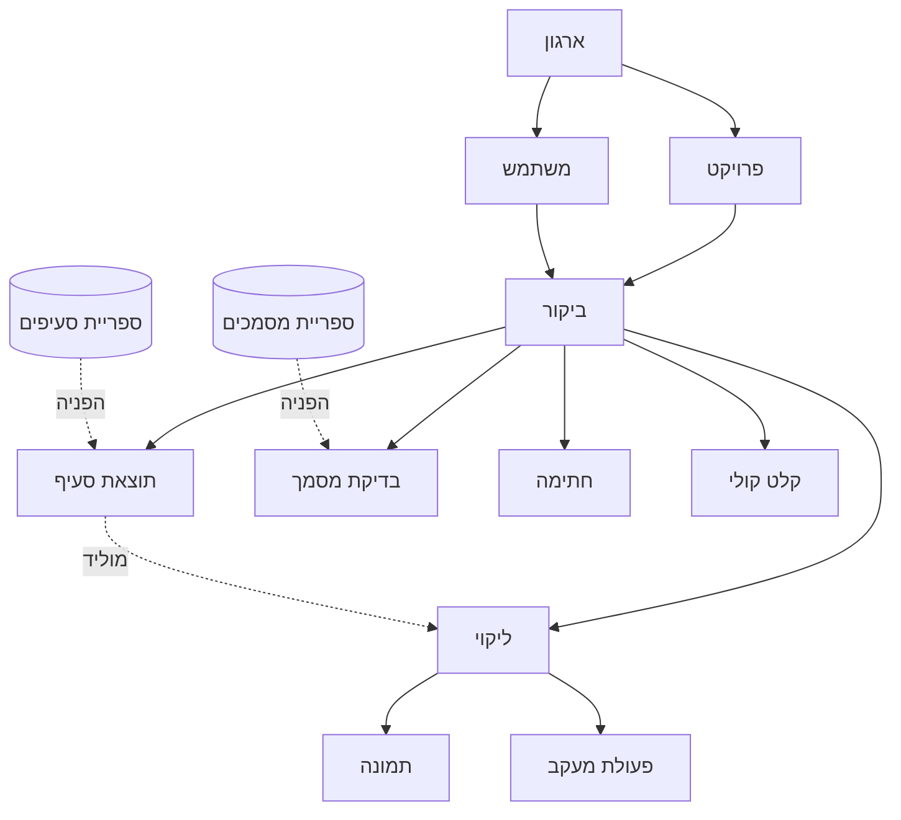

# 02 · מודל נתונים

## תרשים

## ישויות

### ארגון
חברת ההנדסה. מחזיק לוגו, פרטי התקשרות ומנוי. כל הנתונים מבודדים לפי ארגון.

### משתמש
שייך לארגון. תפקיד: בעלים / ממונה / צופה. מחזיק מספר טלפון —
**מזהה הקישור לערוץ הוואטסאפ**, ולכן שדה קריטי ולא רק נוחות.

### פרויקט
אתר או מפעל. מחזיק את מונה הביקורים הרץ.

### ביקור
הישות המרכזית. **מקור האמת היחיד** — כל מסך נגזר ממנה.

| קבוצה | שדות |
|---|---|
| סיווג | סוג מקום עבודה (אתר בנייה / מפעל / אחר) |
| אתר | שם, כתובת, מזמין, קבלן מבצע, מנהל עבודה, מספר עובדים, פעילות, מזג אוויר |
| ממונה | שם, מספר אישור כשירות, תוקף האישור |
| ביקור | תאריך ושעה, מספר ביקור, מלווים |
| סיכום | הערת הממונה, תפוצה, סטטוס |

**שדות חובה** (נאכפים בסכמה, לא רק ב-UI): שם אתר, שם ממונה,
מספר אישור כשירות, תאריך ושעת ביקור. ראה [`15-DESIGN-REQUIREMENTS.md`](15-DESIGN-REQUIREMENTS.md#r4).

### תוצאת סעיף
מפנה לסעיף בספרייה. מחזיק מצב אחד מתוך חמישה **ובברירת מחדל מפורשת
`not_checked`** — לא null. ההבדל בין "החלטתי לא לבדוק" לבין "שכחתי"
הוא כל ההגנה המשפטית על הממונה.

### בדיקת מסמך
מפנה למסמך בספרייה. מצב: קיים / חסר / לא רלוונטי.
`expires_on` (תאריך תפוגה) ו-`attachment`. מסמך שהחוק קוצב לו תוקף
חייב תאריך — "קיים" אינו מצב תקף בפני עצמו. ראה
[`15-DESIGN-REQUIREMENTS.md`](15-DESIGN-REQUIREMENTS.md#r5).

### ליקוי
| שדה | הערה |
|---|---|
| חומרה | נמוכה / בינונית / גבוהה / מיידית — **חובה**, אין ברירת מחדל |
| הופסקה עבודה | בוליאני |
| תיאור | חובה, מינימום תווים |
| מיקום מדויק | |
| אחראי לתיקון | |
| תאריך יעד | |
| פעולה מתקנת | |
| מקור | ידני / קולי / יובא מביקור קודם |
| סטטוס | פתוח / סגור — סגירה דורשת הוכחת ביצוע |

**ליקוי נוצר רק ב-commit מהדיאלוג.** ביטול לא משאיר כלום.
ראה [`15-DESIGN-REQUIREMENTS.md`](15-DESIGN-REQUIREMENTS.md#r1).

### קלט קולי
ישות נפרדת ומכוונת. מחזיקה **את קובץ השמע המקורי** ואת התמליל.
השמע נשמר כראיה — בדוח שעשוי להגיע לחקירה, ההקלטה המקורית שווה
יותר מהתמלים. פירוט: [`08-VOICE-INTAKE.md`](08-VOICE-INTAKE.md).

### חתימה
מי חתם, מתי, ומאיזה מכשיר. שתי חתימות: ממונה ומקבל הדוח.

## כללי שלמות

1. ליקוי חייב להשתייך לביקור. ליקוי שקשור לסעיף חייב שהסעיף יהיה במצב `defect`.
2. סעיף במצב `defect` חייב שיהיה לו ליקוי מקושר. **אין יוצא מן הכלל.**
3. סגירת ביקור חסומה כל עוד יש ליקוי בלי חומרה או בלי תיאור.
4. מחיקת פרויקט עם ביקורים — חסומה.
5. `not_checked` הוא ערך מפורש. אין null במצב סעיף.

כלל 2 הוא [R2](15-DESIGN-REQUIREMENTS.md#r2) — הבדיקה המרכזית.
