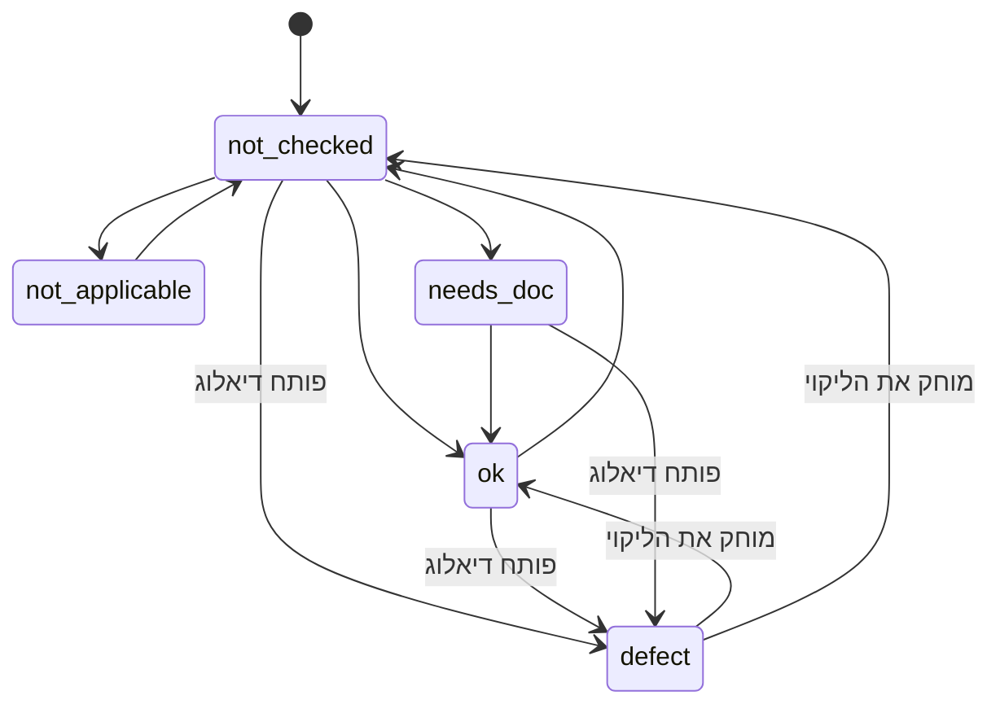
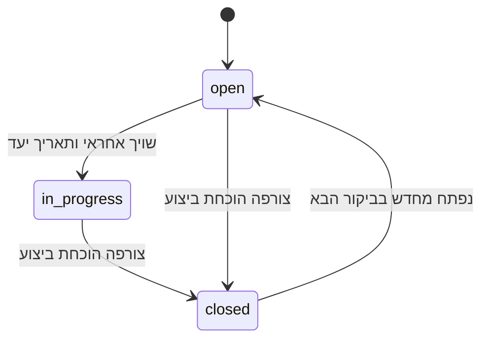
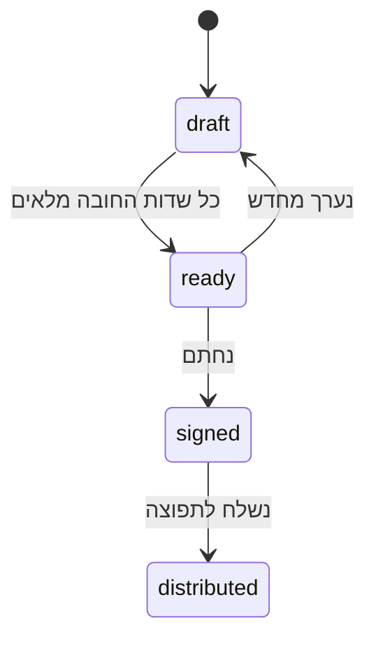

# 03 · מכונת מצבים

המסמך הזה קיים כי הבאג החמור ביותר במערכת הישנה היה באג מצב.

## מצבי סעיף



| מצב | משמעות |
|---|---|
| `not_checked` | **ברירת המחדל.** טרם נבדק |
| `ok` | נבדק ונמצא תקין |
| `defect` | נמצא ליקוי — **חייב ליקוי מקושר** |
| `not_applicable` | לא רלוונטי לאתר הזה |
| `needs_doc` | דורש מסמך שלא הוצג בשטח |

## הכלל שמונע את הבאג

מעבר ל-`defect` הוא **דו-שלבי**:

1. המשתמש בוחר "ליקוי" → נפתח דיאלוג. **המצב עדיין לא השתנה.**
2. המשתמש שומר → נוצר ליקוי **ואז** המצב עובר ל-`defect`, באותה טרנזקציה.

ביטול בשלב 1 מחזיר את הסעיף למצב הקודם שלו. בדיוק לשם כך נשמר
`previous_state` כל עוד הדיאלוג פתוח.

**הכשל הנגדי:** מצב שמשתנה בשלב 1 וביטול שאינו מחזיר אותו — סעיף
מסומן ליקוי בלי רשומת ליקוי, ומסכים שמדווחים מספרים סותרים.
ראה [`15-DESIGN-REQUIREMENTS.md`](15-DESIGN-REQUIREMENTS.md#r1).

## מצבי ליקוי



סגירה דורשת הוכחת ביצוע — תמונה או אישור בכתב. אין סגירה בלחיצה.

## מצבי ביקור



`draft → ready` חסום כל עוד: חסר שדה חובה בביקור, או קיים ליקוי
בלי חומרה או בלי תיאור. ההודעה למשתמש אומרת **מה בדיוק חסם** ומקשרת
לשדה — לא "יש שגיאה".

## נגזרות, לא מונים

כל המספרים במסך הסיכום מחושבים מהביקור בזמן הרינדור:

```
סעיפים שנבדקו = |{i : i.state ≠ not_checked}|
ליקויים פתוחים = |{f : f.status ∈ {open, in_progress}}|
טיפול מיידי    = |{f : f.severity = immediate ∧ f.status ≠ closed}|
מסמכים חסרים   = |{d : d.state = missing}|
```

**אין שדה מונה שמור בשום מקום.** אם מספר נראה שגוי, הבאג הוא בנתון —
לא במונה. זה מה שהופך את הסתירה בין מסכים לבלתי אפשרית מבנית.
