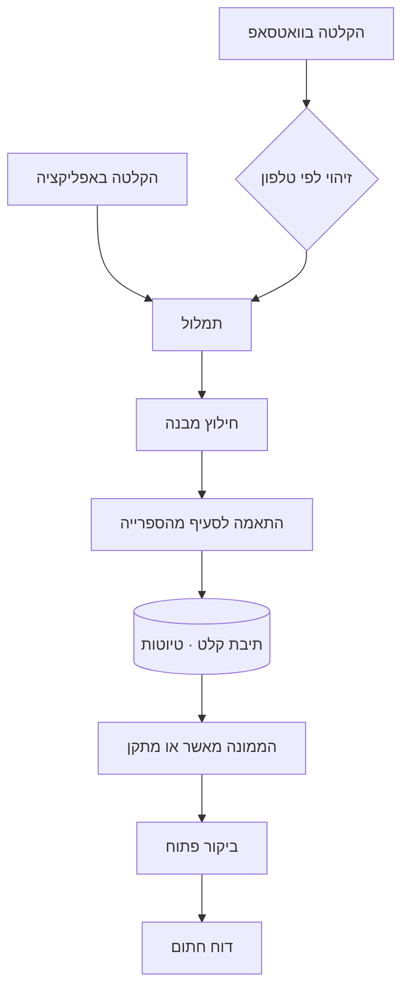

# 08 · קלט קולי

> ארכיטקטורת הערוצים — אפליקציה, טלגרם, מייל, וואטסאפ —
> ב-[`23-INTAKE-CHANNELS.md`](23-INTAKE-CHANNELS.md).

## המצב

השירות כבר קיים ומשווק: "מקליטים ליקוי. שולחים בוואטסאפ. הדוח מוכן."
התשתית קיימת — זיהוי לפי מספר טלפון, ערוץ וואטסאפ נכנס, עיבוד הקלטה.

**אבל הוא לא מחובר למערכת.** אין תיבת קלט להקלטות שהגיעו, אין דרך לצרף
הקלטה לביקור קיים, ואין ישות שמחזיקה שמע או תמליל. דוח שנולד בוואטסאפ
ודוח שנולד באפליקציה הם שני מסלולים נפרדים שלא נפגשים.

## העיקרון

ההקלטה אינה ערוץ נפרד שמייצר PDF. היא **דרך הקלט העיקרית של אותה מערכת**.

## ארבעת השינויים

**1. ישות קלט קולי.**
מחזיקה את קובץ השמע המקורי, התמליל, המקור, חותמת זמן, וקישור לליקוי
שנולד ממנה. **השמע נשמר כראיה** — בדוח שעשוי להגיע לחקירה, ההקלטה
המקורית שווה יותר מהתמליל.

**2. תיבת קלט.**
מסך שמרכז הקלטות שהגיעו וטרם שויכו לביקור. הממונה משייך בלחיצה.
זה מה שמחבר את שני המסלולים.

**3. התאמה אוטומטית לסעיף.**
התמליל עובר מול ספריית הבדיקה ומוצע הסעיף והתקנה הרלוונטיים.
**זה מה שהופך הקלטה לליקוי עם אסמכתא** — הערך האמיתי של הספרייה.
בשילוב עם קורפוס החקיקה ([`21-LEGISLATION-CORPUS.md`](21-LEGISLATION-CORPUS.md))
אפשר גם להציג את נוסח התקנה עצמו.

**4. טיוטה, לא רשומה סופית.**
מה שה-AI מחלץ מגיע כטיוטה לאישור. הממונה חותם — האחריות המשפטית עליו,
והמערכת חייבת לשקף את זה. אין מסלול שבו טקסט שנוצר אוטומטית נכנס
לדוח חתום בלי שאדם אישר אותו.

## הקול במרכז

הבנייה צריכה להעמיד את הקול במרכז: **הממונה מדבר בזמן הסיור, והמערכת
ממלאת את הטופס ברקע.** מספר הוואטסאפ הוא משתנה סביבה ולא החלטת
ארכיטקטורה ([Q5](20-OPEN-QUESTIONS.md#q5), [`19-ENVIRONMENTS.md`](19-ENVIRONMENTS.md)).

## פרטיות ודיוור

הודעת וואטסאפ תפעולית (דוח שהמשתמש ביקש) **אינה** דיוור שיווקי.
הפרדה נקייה בין הערוצים היא מה שמגן משפטית —
ראה [`07-LEGAL-COMPLIANCE.md`](07-LEGAL-COMPLIANCE.md#2--דיוור--ההפרה-המובהקת-ביותר-שנמצאה).

הקלטות שמע מאתרי לקוחות הן מידע רגיש. מדיניות שמירה ומחיקה נדרשת.
