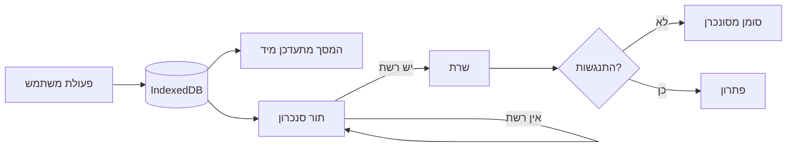

# 10 · עבודה ללא רשת

## למה זה שלב ראשון ולא תוספת

אתרי בנייה הם סביבת קליטה גרועה מטבעם. מרתפים, מבני בטון, קומות גבוהות.
מערכת שנשענת על רשת רציפה לא עובדת במקום שהיא אמורה לעבוד.

המערכת הקיימת טוענת את Supabase ואת מנוע ה-PDF מ-CDN חיצוני בזמן ריצה,
ואין בה Service Worker. בקליטה גרועה היא פשוט לא עולה.

## העיקרון

**כל כתיבה נוחתת מקומית ומוחזרת למסך מיד.** הסנכרון קורה ברקע.
המשתמש לעולם לא מחכה לרשת.



## דרישות

**Service Worker.** כל נכסי האפליקציה נשמרים במטמון בהתקנה.
פתיחה שנייה עובדת בלי רשת בכלל.

**ספריות במטמון.** 112 הסעיפים, 13 המסמכים, **וקורפוס החקיקה**
נטענים מקומית בהתקנה ראשונה. אסמכתא נלחצת עובדת גם אופליין.

**תור כתיבה עמיד.** נשמר ב-IndexedDB, שורד סגירת דפדפן וכיבוי מכשיר.
ניסיון חוזר עם נסיגה מעריכית.

**תמונות.** נדחסות מקומית לפני הכניסה לתור. תמונה מטלפון מודרני
היא 4-8MB; בתור היא צריכה להיות מתחת ל-500KB.

**חיווי כן.** שלושה מצבים מובחנים: מסונכרן · ממתין (עם מספר פריטים) ·
כשל. המערכת הקיימת מציגה "מסונכרן" קבוע — חיווי שאי אפשר לסמוך עליו
גרוע מאין חיווי.

## התנגשויות

ביקור נערך בדרך כלל על ידי אדם אחד ממכשיר אחד, אז התנגשות אמיתית נדירה.
המדיניות: **הכתיבה המקומית מנצחת**, אבל שינוי שהגיע מהשרת ונדחה נשמר
בהיסטוריה ולא נזרק. מחיקה לעולם אינה אוטומטית.

## בדיקות

```
1. מילוי ביקור מלא במצב טיסה → סגירת דפדפן → פתיחה → הכל שם
2. הקלטת ליקוי עם 3 תמונות אופליין → חיבור רשת → סנכרון מלא
3. כשל רשת באמצע סנכרון → ניסיון חוזר → אין כפילות ואין אובדן
4. טעינה ראשונה ברשת מוגבלת (Slow 3G) → מתחת ל-5 שניות ל-interactive
```
