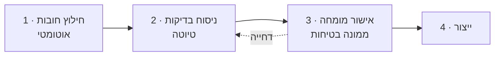

# 13 · בניית הספרייה

מחליף את מסמך ההגירה. **אין הגירה** — הספרייה נבנית מאפס מקורפוס
החקיקה, והוא שלך.

## למה זה עדיף, ולא רק נכון

| | ספרייה מועתקת | ספרייה נגזרת |
|---|---|---|
| בעלות | שאלה פתוחה | שלך |
| קישור לנוסח | אין | `scope` לכל סעיף |
| אימות | אי אפשר | `source_excerpt` מול המקור |
| עדכון כשתקנה משתנה | ידני, אם בכלל | מסומן אוטומטית |
| כיסוי | מה שהיה שם | מה שהחוק דורש |

הנקודה האחרונה היא המהותית. ספרייה מועתקת משקפת את מה שמישהו אחר
הספיק לכתוב. ספרייה נגזרת מהחקיקה משקפת את **מה שהחוק באמת דורש** —
ואפשר למדוד כיסוי מולו.

## התהליך — ארבעה שלבים



### שלב 1 · חילוץ חובות — אוטומטי

`scripts/extract-obligations.ts` עובר על נוסחי הגל ומאתר סעיפים
שמטילים חובה. רשימת מילות המפתח שתוכננה כאן —

`חייב` · `אחראי לכך` · `לא ייעשה אלא` · `יינקטו` · `יותקן` ·
`יימצא` · `ימנה` · `יודיע` · `אין להשתמש` · `לא יפעיל` · `יש לוודא`

— תופסת בפועל פחות ממחצית החובות בגל 1, ומחמיצה בדיוק את מה שנבדק
בשטח: "מנהל העבודה יבדוק כל פיגום" (2.2, תקנה 20). הסיבה מבנית —
החובה מנוסחת בכל פועל עתיד, והפעלים אינם קבוצה סגורה. לכן הסקריפט
מוסיף **משפחות של צורות** (איסור עם חריג, בעל חובה + עתיד, עתיד סביל)
לצד רשימת המילים. נימוק מלא: [`18-DECISIONS.md`](18-DECISIONS.md#d6).

הפלט הוא **מועמדים**, לא סעיפי בדיקה, ב-`data/obligations/<scope>.json`:
מזהה נוסח, מספר סעיף ונתיב מלא (`8(א)(1)(ב)`), הציטוט מילה במילה,
שורות הרישה שהפסקה תלויה בהן, הסימנים שנתפסו, ודגל אם הסעיף חל על
אתר בנייה, מפעל או שניהם.

שתי ערובות בסקריפט עצמו: כל ציטוט נבדק שהוא נמצא בנוסח כלשונו, ורצף
מספרי התקנות נבדק מול ה-frontmatter — פענוח שגוי עוצר בלי לכתוב פלט.

`sections_without_candidates` מונה את התקנות שלא נמצא בהן מועמד. זו
רשת הביטחון על החמצה, והיא נקראת ידנית לפני שעוברים לשלב 2.

### שלב 2 · ניסוח בדיקות — טיוטה

כל חובה הופכת לשאלה שניתן לענות עליה בשטח. החובה אומרת מה החוק דורש;
הבדיקה שואלת אם זה קיים כאן ועכשיו.

**כללי ניסוח:**

- שאלה אחת, בדיקה אחת. חובה מורכבת מתפצלת לכמה סעיפים.
- ניתן לענות מהתבוננות. "האם קיים שילוט" ולא "האם השילוט תקין לפי התקנה".
- בלי ז'רגון שאינו בנוסח.
- `source_excerpt` נשמר תמיד, מילה במילה.

**זה שלב טיוטה. שום דבר ממנו לא נכנס לייצור.**

### שלב 3 · אישור מומחה — חוסם

ממונה בטיחות מוסמך עובר סעיף-סעיף מול `source_excerpt` ומכריע:
מאשר · מנסח מחדש · מפצל · דוחה (החובה לא רלוונטית לבדיקת שטח).

כל סעיף מאושר מקבל `reviewed_by` ו-`reviewed_on`.

> **סעיף בלי `reviewed_by` נחסם ב-CI ולא מגיע לייצור.**
> זו הבדיקה שמחליפה את אימות הספירות שהיה בגישה הקודמת.

### שלב 4 · ייצור

הסעיפים המאושרים נכתבים ל-`data/`, עם `version` ו-`effective_date`.

## סדר עדיפויות — מה קודם

לא בונים 43 נוסחים בבת אחת. הסדר לפי מה שממונה באתר בנייה פוגש בפועל:

| גל | נוסחים | למה |
|---|---|---|
| **1** | 2.2 עבודות בניה · 2.1 עבודה בגובה | ליבת אתר הבנייה |
| **2** | 2.6 עגורנאים · 2.6.1 עגורני צריח · 2.3 ציוד מגן אישי | הסיכונים הקטלניים |
| **3** | 1.1 ממונים · 1.3 הדרכה · 2.4 חשמל · 2.5 עזרה ראשונה | חובות רוחב |
| **4** | 2.9 גגות · 2.4.2 חשמל ארעי · 2.7 SDS | ענפי |
| **5** | 2.0 פקודת הבטיחות · 3.x גהות | מצב מפעל |

**גל 1 לבדו נותן מוצר שמיש.** אין צורך לחכות לכיסוי מלא.

## מדידת כיסוי

היתרון שספרייה מועתקת לא נותנת: אפשר למדוד.

```
כיסוי(נוסח) = סעיפים מאושרים ÷ חובות שחולצו
```

הדוח מציג לכל נוסח: כמה חובות נמצאו, כמה נוסחו, כמה אושרו, וכמה נדחו
ומדוע. **פער הוא נתון, לא הפתעה.**

## מה לא לעשות

**אל תשתמש ב-LLM כדי לייצר סעיפים בלי אישור אנושי.** ניסוח טיוטה —
כן. כתיבת ספרייה שנכנסת לדוח חתום — לא.
זה בדיוק המקרה של [`25-AI-SECURITY.md`](25-AI-SECURITY.md#1--אסימטריה--ai-מציע-ליקויים-לעולם-לא-תקינות):
מודל שמנסח חובה שאינה קיימת יוצר בדיקה שתמיד עוברת.

**אל תעתיק ספרייה ממערכת אחרת** — לא כבסיס, לא כ"השראה", ולא
כ"בדיקה שלא פספסנו". אם פספסנו, מדידת הכיסוי תראה את זה מול החוק.
