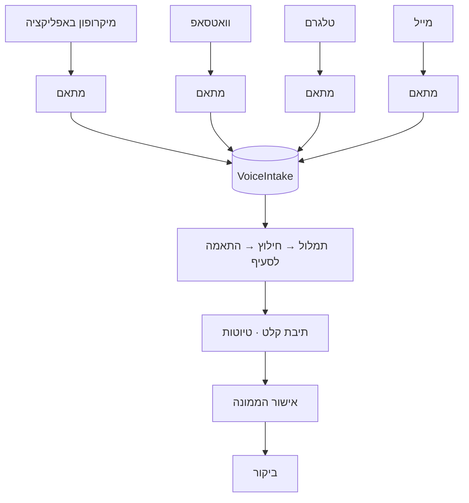

# 23 · ערוצי קלט

## השורה התחתונה

**כן — בונים את כל התשתית עכשיו, ומחברים כל ערוץ כשהוא מוכן.**

זו לא פשרה. הדרישה להוסיף טלגרם ומייל היא בדיוק מה שמוכיח למה
הארכיטקטורה הזו נכונה: **ערוץ הוא מתאם דק בקצה, לא הצינור.**

## העיקרון

הקלטה יכולה להגיע מארבעה מקומות. **כולם מייצרים את אותה ישות
`VoiceIntake` בדיוק**, וכל מה שקורה אחר כך זהה.

**כל מה שמתחת ל-`VoiceIntake` אינו יודע מאיזה ערוץ הגיע.**
מתאם הוא כ-200 שורות. התמלול, החילוץ, ההתאמה ל-112 הסעיפים,
תיבת הקלט וזרימת האישור — 95% מהערך, אפס תלות בספק כלשהו.

## השוואת הערוצים

| ערוץ | חוזק זיהוי | עלות | חיכוך הקמה | מדיה |
|---|---|---|---|---|
| מיקרופון באפליקציה | **חזק** — משתמש מחובר | אפס | אפס | שמע, תמונות |
| טלגרם | בינוני — קישור חד-פעמי | **אפס** | דקות | שמע, תמונות, קבצים |
| וואטסאפ | בינוני — טלפון מאומת | לכל הודעה יוצאת | ימים | שמע, תמונות |
| מייל | **חלש** — ניתן לזיוף | כמעט אפס | שעות | קבצים גדולים |

## המלצת סדר

**1 · מיקרופון באפליקציה** — קודם. אפס תלות חיצונית, זיהוי חזק,
ומאפשר לבדוק את כל הצינור מקצה לקצה. כל הסיכון האמיתי נמצא בתמלול
ובהתאמה לסעיף, לא בערוץ.

**2 · טלגרם** — השני, כי הוא הזול והמהיר ביותר. בוט נפתח ב-BotFather
תוך דקות, בלי אימות עסקי, בלי עלות להודעה, בלי חלון זמן.
**זה הערוץ להוכיח בו את המודל** לפני שמשקיעים בוואטסאפ.

**3 · מייל** — במקביל. שימושי בעיקר לקליטת **מסמכים**, לא ממצאים.

**4 · וואטסאפ** — אחרון, כי הוא היקר והאיטי להקמה. אבל הוא זה
שהלקוחות בפועל משתמשים בו, אז הוא היעד.

## טלגרם

**יתרונות:** חינם לחלוטין. הקמה בדקות דרך BotFather. אין חלון 24 שעות.
אין אישור שם תצוגה. הורדת מדיה פשוטה — `file_id` → `getFile` → הורדה.

**ההבדל הקריטי מוואטסאפ — זיהוי.**
וואטסאפ מוסרת את מספר הטלפון של השולח אוטומטית. **טלגרם לא.**
מקבלים `user_id` של טלגרם בלבד.

לכן נדרש **קישור חשבון חד-פעמי**: המשתמש לוחץ באפליקציה על
"חבר טלגרם", נפתח הבוט עם `start` וטוקן חד-פעמי, והמערכת קושרת
`telegram_user_id` ← משתמש. אפשר גם בקשת שיתוף איש קשר, אבל
הטוקן נקי יותר ולא דורש הרשאה.

**מגבלה:** `getFile` מוריד קבצים עד 20MB. הקלטות קוליות קטנות בהרבה,
אבל וידאו או אלבום תמונות עלול לחרוג. לטפל בשגיאה, לא להתעלם.

## מייל

**שימוש עיקרי: קליטת מסמכים, לא ממצאים.**

זו התובנה המעשית — 13 מסמכי החובה מגיעים מקבלנים, ממנהלי עבודה
ומבודקים מוסמכים, **והם מגיעים במייל ממילא**. תסקיר עגורן, אישור
הדרכת עבודה בגובה, מינוי מנהל עבודה. כתובת ייעודית לכל פרויקט
(`proj-<id>@…`) הופכת את זה לזרימה טבעית במקום העלאה ידנית.

**זיהוי מייל הוא החלש ביותר.** כתובת השולח ניתנת לזיוף בקלות.
מינימום נדרש: אימות SPF ו-DKIM ודחיית הודעה שנכשלת. וגם אז —
**מייל לעולם לא מספיק לחתימה**, רק לטיוטה או לצירוף מסמך.

**מימוש:** שירות קליטה נכנסת (Postmark, SendGrid Inbound Parse,
Mailgun Routes) ששולח webhook. לא לבנות שרת IMAP.

## מה חייב להיות נכון מהיום הראשון

גם אם כל הערוצים כבויים, אלה נבנים עכשיו — יקר לשנות אחר כך:

| מה | למה |
|---|---|
| `VoiceIntake` שומרת **שמע גולמי**, לא רק תמליל | הוספה בדיעבד = אין שמע לרשומות ישנות |
| `source` — `app` / `whatsapp` / `telegram` / `email` | בלי זה אין הבחנה רטרואקטיבית |
| `external_message_id` + אידמפוטנטיות | כל הערוצים שולחים שוב; בלי מפתח ייחודי נוצרות כפילויות |
| טבלת קישורי זהות פר-ערוץ | טלפון לוואטסאפ, `user_id` לטלגרם, כתובת למייל |
| אחסון פרטי + מדיניות שמירה | הקלטות ומסמכים מאתרי לקוחות |
| הפרדה בין תפעולי לשיווקי | [`07-LEGAL-COMPLIANCE.md`](07-LEGAL-COMPLIANCE.md#2--דיוור--ההפרה-המובהקת-ביותר-שנמצאה) |

**טבלת הזהויות היא הנקודה שבה קל לטעות.** אל תשים `telegram_id`
כעמודה בטבלת המשתמשים. ישות נפרדת `channel_identity`
(`user_id`, `channel`, `external_id`, `verified_at`) — אחרת כל ערוץ
חדש הוא מיגרציה.

## כלל שחוצה את כל הערוצים

**אף ערוץ חיצוני אינו מספיק לחתימה.**

זיהוי בכל ארבעת הערוצים מספיק כדי לשייך טיוטה. הוא **לא** מספיק
כדי לחתום על מסמך משפטי שהאחריות עליו אישית. קול או מסמך יוצרים
טיוטה; חתימה דורשת התחברות באפליקציה. זו ההגנה המרכזית, והיא
אותה הגנה בכל ערוץ.

**שיוך לביקור לא מנחשים.** הקלטה לא יודעת לאיזה אתר היא שייכת.
ביקור פתוח אחרון של אותו משתמש, או בחירה מפורשת בתיבת הקלט.
ליקוי ששויך לאתר הלא נכון גרוע מליקוי שלא נרשם.

## מלכודות ספציפיות לוואטסאפ

**בלעדיות המספר.** מספר שנרשם ל-Cloud API לא פועל במקביל באפליקציית
וואטסאפ רגילה או Business. נדרש מספר ייעודי.

**סוף החינם ב-1.10.2026.** תשובה בתוך חלון 24 השעות הופכת לחיוב
בתעריף utility. הודעות נכנסות נשארות חינם. כל דוח שנשלח חזרה
בוואטסאפ הוא עלות משתנה — שיקול נוסף לטובת טלגרם כערוץ ראשון.

**ספריות לא רשמיות** (Baileys, whatsapp-web.js) מפרות תנאי שימוש
וגורמות לחסימת המספר. לא לשקול.

**אימות עסקי מול Meta** לוקח יום עד כמה ימים ודורש מסמכי חברה.
בירוקרטי, לא תלוי בקוד — **להתחיל במקביל לפיתוח, לא אחריו.**

## מקורות

- [Pepper Cloud — תמחור וסוף חלון 24 השעות](https://blog.peppercloud.com/whatsapp-api-pricing-everything-you-need-to-know/)
- [Uptonova — בלעדיות המספר ואימות](https://uptonova.com/blog/whatsapp-business-api-setup-guide-2026)
- [Meta — Cloud API](https://developers.facebook.com/docs/whatsapp/cloud-api)
- [Telegram — Bot API](https://core.telegram.org/bots/api)
