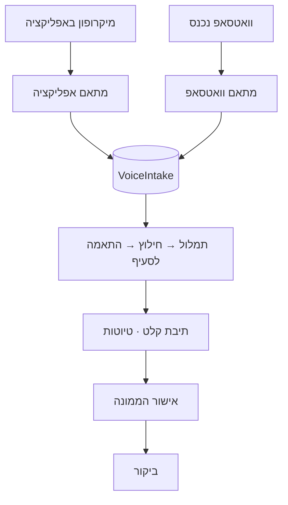

# 23 · ערוץ הוואטסאפ

## השורה התחתונה

**כן — בונים את כל התשתית עכשיו, ומחברים את הוואטסאפ בסוף.**

זה לא פשרה. זו הארכיטקטורה הנכונה גם אילו האישור מ-Meta היה ביד היום.

## העיקרון — הערוץ הוא מתאם, לא הצינור

הקלטה יכולה להגיע משני מקומות: מיקרופון באפליקציה, או הודעת וואטסאפ.
**שניהם מייצרים את אותה ישות `VoiceIntake` בדיוק.** כל מה שקורה אחר כך
זהה לחלוטין.

הקו המקווקו הוא הגבול: **כל מה שמתחת ל-`VoiceIntake` אינו יודע
מאיזה ערוץ הגיע**. מתאם וואטסאפ הוא בערך 200 שורות. כל השאר —
התמלול, החילוץ, ההתאמה ל-112 הסעיפים, תיבת הקלט, זרימת האישור —
הוא 95% מהערך ו-0% תלות ב-Meta.

## למה זה עדיף, לא רק אפשרי

**אפשר לבדוק את הצינור מקצה לקצה לפני ש-Meta אישרה משהו.**
מקליטים באפליקציה, רואים שהתמלול נכון, שההתאמה לסעיף קולעת,
שהטיוטה נוחתת בביקור הנכון. כל הסיכון האמיתי נמצא שם — לא בערוץ.

**הקלטה באפליקציה עשויה להיות הערוץ העדיף ממילא.** אין עלות להודעה,
אין חלון 24 שעות, אין אישור שם תצוגה, ואין תלות בספק חיצוני.
הוואטסאפ הוא **נוחות** — הממונה לא צריך לפתוח אפליקציה — לא תשתית.

**מפחית סיכון ספק.** אם Meta משנה תמחור, אם חשבון נחסם, אם מחליטים
לעבור ל-BSP — נוגעים במתאם בלבד.

## מה חייב להיות נכון מהיום הראשון

אלה דברים שיקר לשנות אחר כך. גם אם הוואטסאפ כבוי, הם נבנים עכשיו:

| מה | למה |
|---|---|
| `VoiceIntake` שומרת **שמע גולמי** ולא רק תמליל | הוספה בדיעבד = אין שמע לרשומות ישנות |
| שדה `source` (`app` / `whatsapp`) | בלי זה אין הבחנה רטרואקטיבית |
| `external_message_id` + אידמפוטנטיות | Meta שולחת הודעות שוב; בלי מפתח ייחודי נוצרות כפילויות |
| טלפון מאומת ב-SMS כמפתח זיהוי | זה הקישור לערוץ; אימות בדיעבד למשתמשים קיימים כואב |
| אחסון פרטי + מדיניות שמירה לשמע | הקלטות מאתרי לקוחות הן מידע רגיש |
| הפרדה בין הודעה תפעולית לדיוור שיווקי | [`07-LEGAL-COMPLIANCE.md`](07-LEGAL-COMPLIANCE.md#2--דיוור--ההפרה-המובהקת-ביותר-שנמצאה) |

## מה נדחה בבטחה

- מקלט ה-webhook
- שולח ההודעות היוצא ותבניות מאושרות
- אימות עסקי ואישור שם תצוגה מול Meta
- כל שאלת התמחור

## סדר עבודה מומלץ

1. **שלב 6א** — הקלטה באפליקציה, `VoiceIntake` מלאה, תמלול, חילוץ,
   התאמה לסעיף, תיבת קלט. עובד מקצה לקצה. **אפס תלות חיצונית.**
2. **במקביל, לא בטור** — להתחיל את האימות העסקי מול Meta. הוא לוקח
   יום עד כמה ימים, הוא בירוקרטי, והוא לא תלוי בקוד.
3. **שלב 6ב** — מתאם הוואטסאפ. webhook, הורדת מדיה, מיפוי זהות,
   שליחה חזרה. נבדק מול מספר בדיקה של Cloud API או sandbox של BSP —
   **שניהם לא דורשים אימות עסקי מלא**.
4. החלפה למספר ייצור כשהאישור מגיע.

## מלכודות שכבר תועדו

**בלעדיות המספר.** מספר שנרשם ל-Cloud API לא פועל במקביל באפליקציית
וואטסאפ רגילה או Business. נדרש מספר ייעודי.

**סוף החינם ב-1.10.2026.** תשובה בתוך חלון 24 השעות הופכת לחיוב
בתעריף utility. הודעות נכנסות נשארות חינם. כל דוח שנשלח חזרה בוואטסאפ
הוא עלות משתנה — שיקול לטובת משיכה מהאפליקציה כברירת מחדל.

**זיהוי לפי טלפון הוא חלש.** מספיק לשיוך טיוטה, **לא מספיק לחתימה**.
קול יוצר טיוטה; חתימה דורשת התחברות. זו ההגנה המרכזית.

**שיוך לביקור לא מנחשים.** הקלטה לא יודעת לאיזה אתר היא שייכת.
ביקור פתוח אחרון, או בחירה מפורשת בתיבת הקלט. ליקוי ששויך לאתר
הלא נכון גרוע מליקוי שלא נרשם.

## מקורות

- [Pepper Cloud — תמחור ושינויי חלון 24 השעות](https://blog.peppercloud.com/whatsapp-api-pricing-everything-you-need-to-know/)
- [Uptonova — בלעדיות המספר ותהליך האימות](https://uptonova.com/blog/whatsapp-business-api-setup-guide-2026)
- [Meta — תיעוד Cloud API](https://developers.facebook.com/docs/whatsapp/cloud-api)
