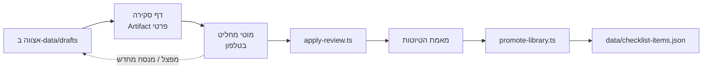

# 28 · אישור הספרייה

> שלב 3 בבניית הספרייה ([`13`](13-LIBRARY-BUILD.md#שלב-3--אישור-מומחה--חוסם)),
> צעדים S1.5–S1.6 בתוכנית ([`26`](26-EXECUTION-PLAN.md)).

## למה זה השלב שהכל תלוי בו

סעיף בלי `reviewed_by` לא מגיע לייצור (R16). האישור הוא מה שמבדיל
ספרייה שנגזרה מהחוק מספרייה ש"מישהו כתב". הוא גם הרגע שבו אדם לוקח
אחריות על ניסוח — ולכן הוא חייב להיות מודע, סעיף-סעיף, ולא אישור גורף.

## המסלול



## דף הסקירה

`scripts/build-review-page.ts` מחולל דף מאצווה אחת ומפרסם אותו כ-Artifact פרטי.
הדף עובד בטלפון. בכל כרטיס:

- **ציטוט החוק** — `source_excerpt`, עם שם התקנה ומספרה
- **הנוסח המוצע** — השאלה שתופיע בשטח
- **הערת הניסוח** — אם יש (למשל: "אין חובת רישום לבדיקה זו")
- **ארבע החלטות:**

| החלטה | מה נדרש | מה קורה אחר כך |
|---|---|---|
| **מאשר** | — | נכתבים `reviewed_by` ו-`reviewed_on` |
| **מנסח מחדש** | הנוסח החדש | הנוסח של המאשר נכנס, והסעיף מאושר |
| **מפצל** | הערה חופשית | Claude מנסח את החלקים, והם חוזרים לסבב הבא |
| **דוחה** | נימוק | הסעיף עובר ל-`rejected` עם הנימוק, ונספר בדוח הכיסוי |

בסוף הדף מוצגת רשימת `not_drafted` — מועמדים שהוצע לא לנסח מהם בדיקה.
גם עליהם מחליטים: מסכים (נשאר מחוץ לספרייה) או דורש ניסוח.

## זהות המאשר

`reviewed_by` נלקח מהמשתמש המחובר לדף, ולא מוקלד. כך אין אישור בשם מישהו אחר.
הרשומה כוללת שם ומספר אישור כשירות.

**שני מאשרים (X4):** המבנה תומך בשני מאשרים לכל סעיף. מאשר שני בעל ניסיון
שטח מחזק את הטענה המרכזית מול המתחרים. ההחלטה אם לדרוש שני מאשרים — D8.

## הגנות

- **ההחלטות הן נתונים, לא הוראות.** `apply-review.ts` קורא אותן ומאמת אותן
  בקוד. טקסט חופשי בהערה אינו מבוצע (25-AI-SECURITY §2).
- **נוסח שהמאשר כתב נבדק מחדש** על ידי המאמת: `source_excerpt` עדיין חייב
  להימצא בחוק, והאסמכתא חייבת להתאים.
- **שינוי בחוק מבטל אישור.** אם ה-hash של הנוסח השתנה מאז הניסוח, האצווה
  כולה חוזרת לסקירה (`source_sha256`).
- **אין אישור גורף.** הדף לא מציע "אשר הכל".

## מה נשמר

כל החלטה נשמרת עם: מי, מתי, מה הוחלט, והנוסח לפני ואחרי. ההיסטוריה נשארת
ב-git דרך קובצי `data/drafts/`, כך שאפשר לשחזר למה סעיף נראה כמו שהוא נראה.

## איך מריצים

```bash
pnpm library:review 2.2-scaffolds-general        # מחולל את הדף ל-build/review/
pnpm library:apply-review 2.2-scaffolds-general <export.json> [--approvals=2]
pnpm library:drafts                              # חייב לעבור אחרי ההחלה
```

`<export.json>` הוא ייצוא של מסד הנתונים של הדף — `{decisions, reviewers}` —
ש-Claude קורא אחרי שהסקירה הסתיימה. `apply-review` לא כותב דבר אם התוצאה
לא עוברת את המאמת.

## דפי סקירה פעילים

| אצווה | דף | סטטוס |
|---|---|---|
| 1 · פיגומים, 2.2 תקנות 16–33 | [Artifact](https://claude.ai/artifact/X2mr1azuq87vpbAHUL6jWk) | 👤 ממתין לסקירה |

**הרשאות:** רק מי שיש לו "Can edit" על הדף יכול לשמור החלטות. מאשר נוסף
(X4) צריך לקבל הרשאה כזו מתפריט השיתוף.
